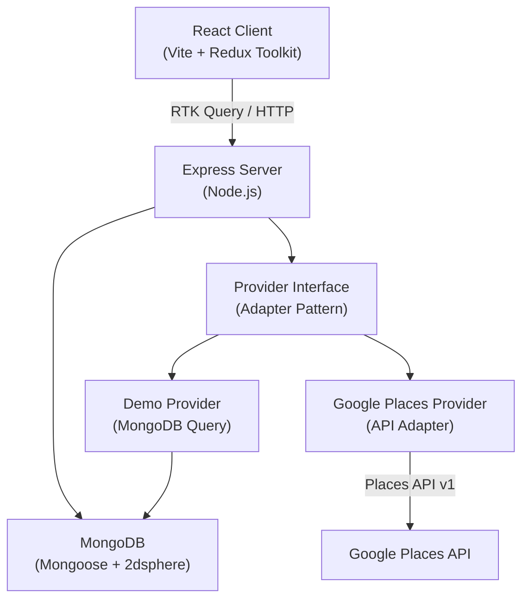

# HealthRadius – Nearby Hospital Discovery and Trust Platform

**A production-style MERN-stack college project** that helps users find hospitals within a configurable radius, compare them side-by-side, and trust the information via a transparent recommendation algorithm and dual-rating system.

> **Medical Disclaimer:** This platform provides hospital directory information and does not provide medical advice. Ratings and distance do not represent clinical quality. In an emergency, contact your local emergency service immediately.

---

## Screenshots

> Run `npm run dev`, seed demo data with `npm run seed`, then open `http://localhost:5173` to see the running application.

---

## Main Features

- 🗺️ **Geolocation Search** – Browser GPS or manual/demo location for 1–5 km hospital discovery
- 🏥 **Hospital Cards** – Name, address, distance, dual ratings, open status, emergency availability
- ⚖️ **Side-by-side Comparison** – Compare up to 3 hospitals on 15+ attributes
- 🌟 **Transparent Recommendations** – Bayesian-average score with explained reasons
- 🔒 **Dual Rating System** – External provider rating + HealthRadius community rating, never combined
- ✅ **Trust Verification** – Verified, Community-sourced, or Demo Data badges
- ❤️ **Favourites** – Save hospitals; guest-friendly with pending action after login
- 💬 **Reviews** – One review per hospital per user; rate, title, comment, flag, moderate
- 🛡️ **Admin Dashboard** – Reports resolution, review moderation, profile verification management
- 🌐 **Demo Mode** – Fully functional without any Google API keys
- 🔑 **Google Places Mode** – Switch via `HOSPITAL_DATA_PROVIDER=google` environment variable
- 📱 **Responsive Design** – Mobile-first Tailwind CSS interface

---

## Technology Stack

| Layer | Technologies |
|---|---|
| **Frontend** | React 18, Vite, Redux Toolkit + RTK Query, Tailwind CSS, Lucide React, React Router |
| **Backend** | Node.js, Express.js, Mongoose, JWT, bcrypt, Zod, Helmet, CORS, Rate Limiting |
| **Database** | MongoDB with 2dsphere geospatial index |
| **Testing** | Vitest, Supertest, React Testing Library |
| **Dev Tools** | Concurrently, Nodemon, dotenv, ESLint, Prettier |
| **Optional** | Docker Compose (local MongoDB) |

---

## Architecture Overview



---

## Folder Structure

```
healthradius/
├── client/                     # React + Vite frontend
│   ├── src/
│   │   ├── app/                # Redux store + RTK Query API
│   │   ├── components/         # Reusable components
│   │   │   ├── common/         # Navbar, Footer, Skeletons, Rating, Disclaimer
│   │   │   ├── hospitals/      # HospitalCard, FilterSidebar
│   │   │   ├── map/            # SimpleMap radar view
│   │   │   ├── reviews/        # ReviewForm, ReviewList
│   │   │   └── admin/          # Admin-specific components
│   │   ├── features/           # Redux slices (auth, comparison)
│   │   ├── hooks/              # useGeolocation
│   │   ├── pages/              # All route-level pages
│   │   └── tests/              # Frontend unit tests
│   └── .env.example
│
├── server/                     # Express.js backend
│   ├── src/
│   │   ├── config/             # env.js, db.js
│   │   ├── controllers/        # Auth, Hospital, Review, Favorite, Admin
│   │   ├── middleware/         # auth, error, rateLimiter
│   │   ├── models/             # User, DemoHospital, HospitalProfile, Review, Favorite, Report
│   │   ├── routes/             # auth, hospitals, reviews, favorites, admin
│   │   ├── services/
│   │   │   └── hospitalProviders/  # demoProvider, googleProvider, providerInterface
│   │   ├── utils/              # distance.js, recommend.js
│   │   ├── seeds/              # seed.js (20+ demo hospitals)
│   │   └── tests/              # unit.test.js, integration.test.js
│   └── .env.example
│
├── docker-compose.yml          # MongoDB Docker container
└── README.md
```

---

## Recommendation Algorithm

HealthRadius uses a **Bayesian Average** formula to prevent hospitals with few reviews from unfairly outranking well-established ones:

```
weightedRating = (v / (v + m)) * R + (m / (v + m)) * C
```

| Variable | Meaning |
|---|---|
| `R` | Hospital's external raw rating (1.0 – 5.0) |
| `v` | Number of external reviews |
| `m` | Confidence threshold (default: 20 reviews) |
| `C` | Mean rating across all hospitals in current search |

**Final Score weights:**
- **70%** – Weighted Rating Component
- **15%** – Review Volume Confidence
- **15%** – Distance Proximity

> This score is for **discovery only** and does not represent clinical outcomes.

---

## Demo vs Google Provider

| Feature | Demo Mode | Google Mode |
|---|---|---|
| Data source | Local MongoDB (seeded fictional hospitals) | Google Places API v1 |
| Requires API key | ❌ No | ✅ Yes |
| Geospatial queries | MongoDB `$geoWithin` + 2dsphere index | Google Places Nearby Search |
| Setup complexity | Run `npm run seed` | Set `GOOGLE_PLACES_API_KEY` |
| Env variable | `HOSPITAL_DATA_PROVIDER=demo` | `HOSPITAL_DATA_PROVIDER=google` |

---

## Local Setup

### Prerequisites

- Node.js 18+
- MongoDB 6.0+ (local installation or Docker)
- npm 9+

### 1. Clone or Open the Project

```bash
cd C:\Users\Hp\.gemini\antigravity\scratch\healthradius
```

### 2. Install All Dependencies

```bash
npm install
```

### 3. Configure Environment Variables

Copy the example files and fill in secrets:

```bash
# Server
copy server\.env.example server\.env

# Client
copy client\.env.example client\.env
```

**Important:** Edit `server/.env` and set at minimum:
- `SEED_ADMIN_PASSWORD` – your desired admin password
- `JWT_ACCESS_SECRET` – a long random string
- `JWT_REFRESH_SECRET` – a different long random string

### 4. Start MongoDB

**Option A – Local MongoDB:**
```bash
mongod
```

**Option B – Docker:**
```bash
docker-compose up -d
```

### 5. Seed Demo Data

```bash
npm run seed
```

This creates 20+ fictional hospitals around the demo center coordinates and creates the admin account.

### 6. Run the Application

```bash
npm run dev
```

Opens:
- **Frontend:** http://localhost:5173
- **Backend API:** http://localhost:5000/api

---

## Environment Variables

### Server (`server/.env`)

| Variable | Default | Description |
|---|---|---|
| `NODE_ENV` | `development` | Environment mode |
| `PORT` | `5000` | Server port |
| `MONGO_URI` | `mongodb://127.0.0.1:27017/healthradius` | MongoDB connection string |
| `JWT_ACCESS_SECRET` | *(required)* | JWT signing secret for access tokens |
| `JWT_REFRESH_SECRET` | *(required)* | JWT signing secret for refresh tokens |
| `HOSPITAL_DATA_PROVIDER` | `demo` | `demo` or `google` |
| `GOOGLE_PLACES_API_KEY` | *(blank)* | Google Places API key (Google mode only) |
| `DEMO_CENTER_LAT` | `40.7128` | Demo city latitude |
| `DEMO_CENTER_LNG` | `-74.0060` | Demo city longitude |
| `SEED_ADMIN_EMAIL` | `admin@example.com` | Admin account email |
| `SEED_ADMIN_PASSWORD` | *(required)* | Admin account password |
| `EMERGENCY_MESSAGE` | *"In an emergency..."* | Emergency banner message |
| `EMERGENCY_PHONE` | `911` | Emergency phone number |

### Client (`client/.env`)

| Variable | Default | Description |
|---|---|---|
| `VITE_API_BASE_URL` | `http://localhost:5000/api` | Backend API base URL |
| `VITE_APP_NAME` | `HealthRadius` | App display name |

---

## Seed Instructions

```bash
# Seed 20+ fictional demo hospitals (idempotent - safe to run multiple times)
npm run seed

# Reset ALL demo hospital data and re-seed from scratch
npm run seed:reset
```

---

## Admin Account

The admin account is created automatically when the server starts (or when you run `npm run seed`).

Default credentials from `.env`:
```
Email:    admin@example.com
Password: adminpassword123  (change this!)
```

**To access the admin panel:** Log in → the Admin Panel button appears in the navigation.

---

## Test Commands

```bash
# Run all tests
npm run test

# Run only server tests
npm run test:server

# Run only client tests
npm run test:client
```

---

## Production Build

```bash
# Build the React client
npm run build

# Start production server
npm run start
```

---

## API Endpoint Summary

| Method | Endpoint | Description |
|---|---|---|
| GET | `/api/health` | Health check |
| GET | `/api/public-config` | App public configuration |
| POST | `/api/auth/register` | Register new user |
| POST | `/api/auth/login` | Login |
| POST | `/api/auth/refresh` | Refresh token |
| POST | `/api/auth/logout` | Logout |
| GET | `/api/auth/me` | Get current user |
| PATCH | `/api/auth/profile` | Update profile |
| GET | `/api/hospitals/nearby` | Search nearby hospitals |
| GET | `/api/hospitals/:source/:id` | Hospital details |
| GET | `/api/hospitals/:source/:id/reviews` | Hospital reviews |
| POST | `/api/hospitals/:source/:id/reviews` | Submit review |
| POST | `/api/hospitals/:source/:id/report` | Report incorrect info |
| PATCH | `/api/reviews/:id` | Update own review |
| DELETE | `/api/reviews/:id` | Delete own review |
| GET | `/api/favorites` | Get saved hospitals |
| POST | `/api/favorites` | Save hospital |
| DELETE | `/api/favorites/:source/:id` | Remove from favorites |
| GET | `/api/admin/dashboard` | Admin statistics |
| GET | `/api/admin/reports` | View all reports |
| PATCH | `/api/admin/reports/:id` | Update report status |
| GET | `/api/admin/reviews` | View all reviews |
| PATCH | `/api/admin/reviews/:id/moderate` | Moderate review |
| GET | `/api/admin/hospital-profiles` | Hospital profiles |
| PUT | `/api/admin/hospital-profiles/:source/:id` | Update hospital profile |
| PATCH | `/api/admin/users/:id/status` | Activate/deactivate user |

---

## Privacy and Healthcare Disclaimer

- Location coordinates are processed in-browser and stored only in **session storage** (cleared when the tab closes)
- Exact user coordinates are **never stored in the database**
- HealthRadius does **not** store medical records, diagnoses, prescriptions, or treatment data
- Community reviews represent personal opinions and are **not clinical assessments**
- This platform is **not HIPAA regulated** and makes no such claims
- External hospital data is sourced from Google Places or fictional seed data; accuracy is not guaranteed

---

## Known Limitations

1. Google Maps interactive map requires a paid Google Maps JavaScript API key
2. The SimpleMap radar view is a visual approximation, not a navigation tool
3. Email verification is scaffolded but not yet implemented
4. Password reset flow is not implemented in this version
5. Session-based token storage (memory-only) means users must re-login after page refresh unless refresh cookie is valid

---

## Future Improvements

- Email verification with SendGrid or Nodemailer
- Password reset via email
- Push notifications for report resolution
- Advanced geofencing with real-time hospital availability feeds
- Full Google Maps integration with directions overlay
- Appointment booking link support
- Multi-language i18n support
- PWA (Progressive Web App) with offline caching

---

## Resume Description

> **HealthRadius** – A full-stack MERN web application featuring geospatial hospital discovery within a configurable 5 km radius. Built with React, Redux Toolkit, RTK Query, Express.js, MongoDB, and Tailwind CSS. Implements a transparent Bayesian-average recommendation algorithm, JWT authentication with refresh token rotation, dual rating system (external + community), hospital comparison, admin moderation dashboard, and a provider-adapter architecture supporting both live Google Places API and offline demo mode with seeded data.

---

## License

MIT License – Free for educational and personal use.
